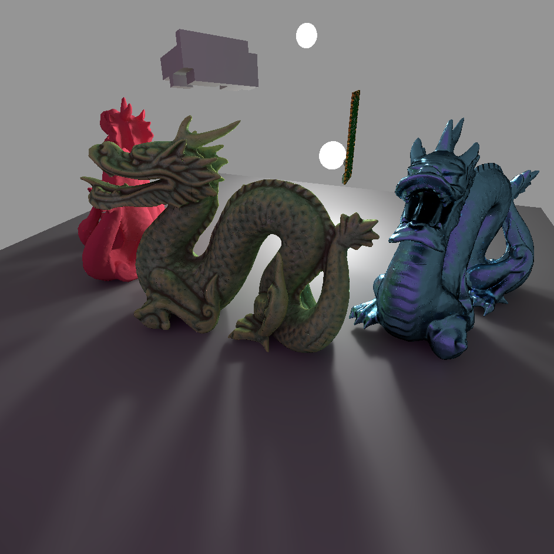

# Trace
Trace is a simple real-time path tracer.

## Dependencies
- Vulkan SDK
- GLFW
- tinyobj
- Vulkan Memory Allocator
- stb

## Build
```
make -j exe
```

## Features
Trace implements a simple unidirectional path tracer with next event estimation. SVGF is used to de-noise the raw path tracer output. Trace runs in real-time on a hardware RT enabled machine. Trace uses Vulkan's ray tracing API, and can trace both triangle meshes and voxel objects.

## Screenshots




